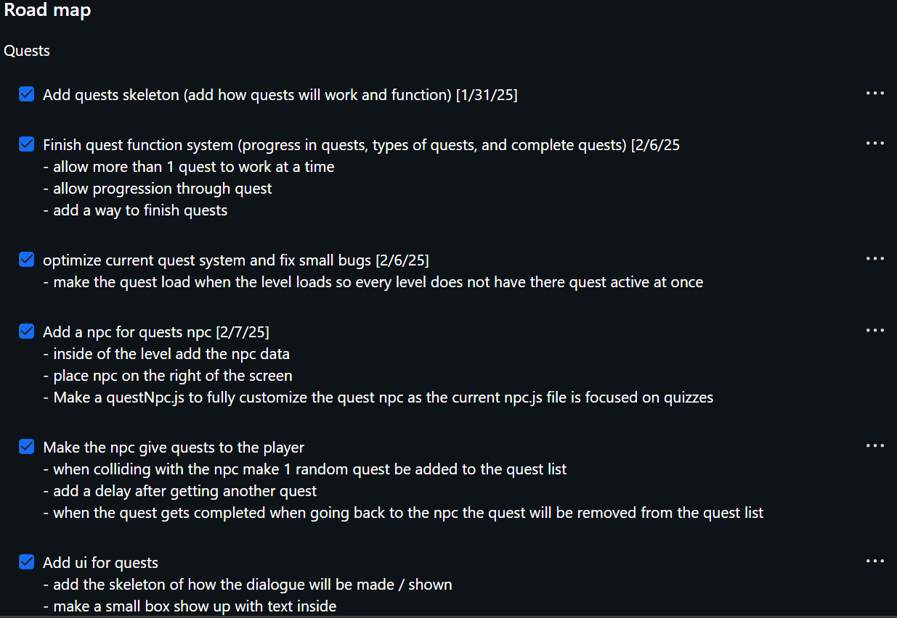
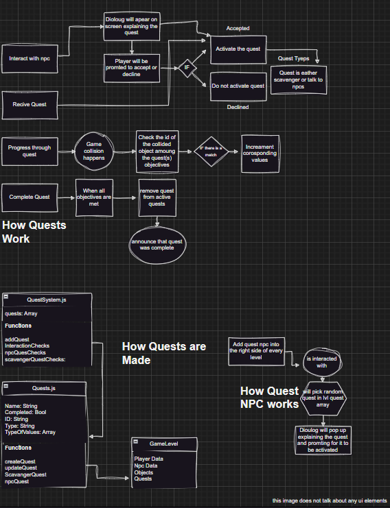

<html>
<table>
    <tr>
        <td><a href="{{site.baseurl}}/cssefinaltri2/controlStructures">Structures</a></td>
        <td><a href="{{site.baseurl}}/cssefinaltri2/datatypes">DataTypes</a></td>
        <td><a href="{{site.baseurl}}/cssefinaltri2/operators">Operators</a></td>
        <td><a href="{{site.baseurl}}/cssefinaltri2/classes">Classes</a></td>
        <td><a href="{{site.baseurl}}/cssefinaltri2/inputoutput">Input Output</a></td>
        <td><a href="{{site.baseurl}}/cssefinaltri2/lifecycle">Life Cycle</a></td>
        <td><a href="{{site.baseurl}}/cssefinaltri2/nightAtTheMuseum">N@tM</a></td>
    </tr>
</table>
</html>

Requrments
```
5 points - 5 things you did over 24 weeks, Skills learned, Issues, Burn Down, Lesson(s) taught, Live Reviews presentation(s) given, GitHub analytics, 8 blogs mentioned above, organizing all. of this in your blog
2 point - Latest Game Feature
1 point - Latest Game Feature blog write up, plus visualization of code understanding (using drawIO)
1 point -  N@tM feedback from your demo, we are hoping for adult feedback or Computer Science student feedback (5 - 10 points of feedback)
```


# Accomplishments

Some things that I am proud of making/using was the ability to use other js files as I have never used seprate js files and used them in sync with one another, This made my coding feel more fluid and orginized. I alos liked my custom object that I added for my scavenger quests. Although sometimes it may be buggy. It was my first custom object on the screen. 

### QuestSystem.js
The Quest System is basicly the brain of the quests as it sends quest updates,handels interation, and updates the ui for the quests. Although it may not be perfect it was the best I could make at the time. As if I were to remake the quest system everything would be done much more diffrently

### UI for quests
The UI for quests is using some CSS (fromp gpt as I cant make it look good) when creating the ui I learned how to find objects inside of the html space to allow me to comunicate to the player outside of just the console.

### Created custom Scavenger Object
Creating the scav object was another difficult addition to my quest system as I needed to learn proper OOP to create more than 1 object at a time

### Quest NPC
The quest npc is the only way on how to get quests. Working with this npc I learned how to use interactions from the player to cause JS code to run, update JS code inside of a diffrint JS file.


# Skills Learned

During this Tri I have learned lots of things in js. Ranging from json objects all the way to full blown classes that are semi oop.

### New
New is a OOP term that lets multiple instances of 1 object be created with diffrint values. This is very usefull for when I added the Scavenger Object into my game. I created ScavengerObject.js Which stored the values for the objects so they can just show on screen. I could have added more complicated stuff into it but I just wanted to letan image just be on the screen. I had to create a new scav obj every time as I did not want to have a class for every object. Thats were the new cmd came in allowing me to have more than 1 scavenger obj at once

### Classes

Classes are hands down the #1 most importanat thing in js. Withought them it will be 10x harder to create my quests system. They allowed me to store all my quest in QuestSystem.js which allowed me to be more orginized. Classes are a buffed version of a json object as they can have custom function insde of them. This is what allowed to to update quest data. create quests, and much more!


### Extend

Extend has been very helpul to create new classes off of the current classes. this allowed me to take values from GameObject.js and Character.js to create ScavengerObject.js and QuestNpc.js as I did not have to re write all of the code to draw the sprite every frame. This allows me to add as many objects or special npcs as I want!


### Class Methods

With class methods I was able to let my custom classes have custom values and functions. Class methods allow you to create the buffed version of a Json array. Methods allow you to run checks that only apply to the class (or object in oop) this allows you to make custom code For example you can have Car.Drive() this is also how objects have the .Destroy() function as it is built into all game objects. This helps lower the amount of repeated code inside of your code.


### Burndown lists

While making my quest system I needed to stay on track and to do so I had to create a checlist so I can stay on tarck. Having a checklist helps you procrastinate less as you know exactly what to do next allowing for you to just jump right into coding as you wont need to create ideas as you have them all down


# Burndowns



Burndowns helped me stay on task while creating my game changes or finding what is the next step on the game feuture. The above image is a small Screen Shot of the burndown I used for creating the quest system.


# Latest Game Feature
<html>
<table>
    <tr>
        <td><a href="{{site.baseurl}}/adventuregame/howitworks">How It Works</a></td>
        <td><a href="{{site.baseurl}}/adventuregame/documentation">Documentation</a></td>
    </tr>
</table>
</html>

### Draw IO



# Slef Refletion

| Topic             | Score 0/1         | Reflection         |
|-------------------|-------------------|--------------------|
| OOP               | 0.75               | There are many places where OOP should have been used and there are some places that I used OOP like in the scav obj, but not in Quest.js  |
| Classes (OOP)     | 0.8               | I have a great understanding on classes But every method I created was a static method which is fine inside of QuestSystem.js but not inside of Quests.js |
| HTML              | 0.85              | I like how I made the quest output it is very well done but when the text is blank the box still shows with nothing inside of it  |
| Sprites           | 0.8               | All sprites but every added sprite was a static sprite only displaying a single frame unlike how the tux npc has a wave animation  |
| Optimisation      | 0.9               | One main thing that makes games laggy is poor optimisation which is mainly caused from too many checks. When creating my quest system checks I did not want it to run every frame, so I made the quest checks only run when a collision occurs |
| Error Handling    | 0.9      | when encountering an err I was able to back track and see where to fix the err even one sthat are as simple as a typo, to erros that are caused between sepreate js files  |
| Testing and Debugging      | 0.9     | I was able to debug very well while testing to see if code section were running, consdtions were met, show when quests are created, shwo the quests, and much more. |


# Next Steps

| Feature            | Changes                |
|--------------------|------------------------|
| Quests         | When I created the quest system I did not use proper OOP limiting what I can do. The next thing I should do is convert the file into an OOP file for much easir use  |
| Giving Quests          | At the moment there is a set amount of quests. A way I want to change this is to add inf quests by randomly making quests with set rules  |
| Scavanger Objects          | The next step to fix the scavenger objects is to fix the quest being compleated instantly some times |
| More Quest Types          | If I were to add more quest types I would add way to give object from around the map to npcs to complete the quest and give rewards when finsihing them  |
| PLayer Movment          | The next step for the player movement to to make it move at a more set pace that does not speed up over time  |


